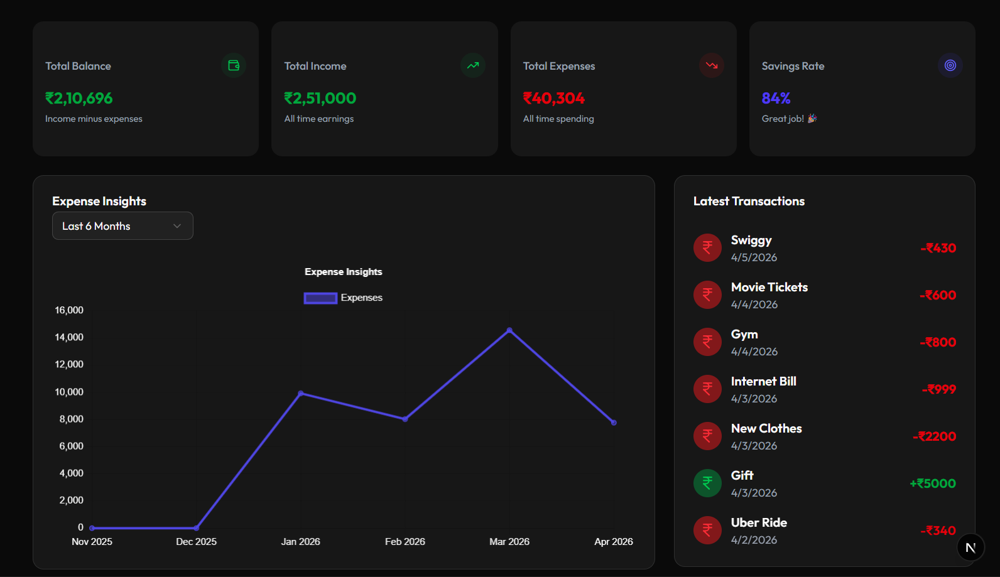
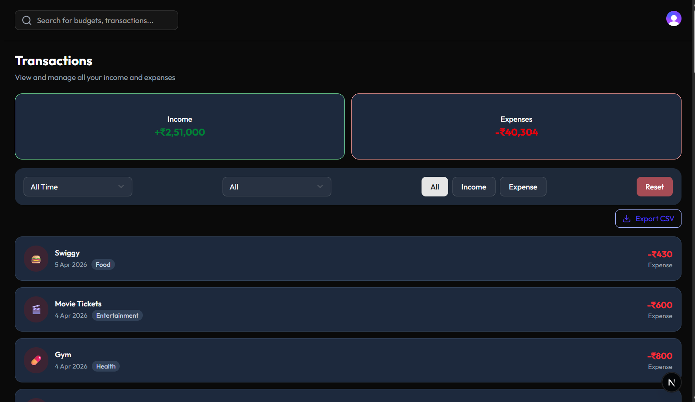
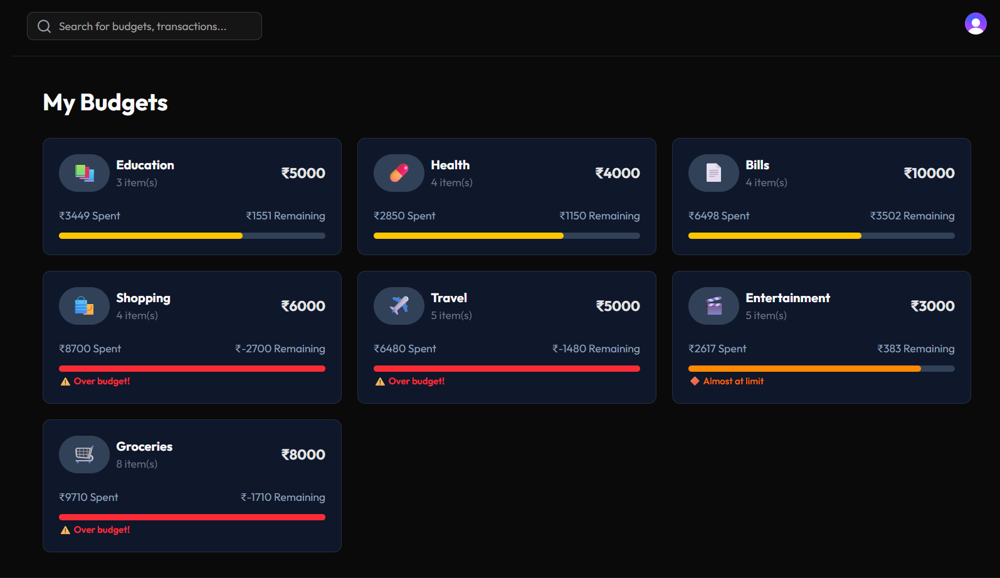

# Trackify — Personal Finance Dashboard

A full-stack personal finance web application built with **Next.js 15**, **Tailwind CSS**, and **Neon (Postgres)**. Track income, manage budgets, visualize spending patterns, and get smart financial insights — all in one clean, responsive interface.

**Live Demo:** [https://trackify-opal.vercel.app/](https://trackify-opal.vercel.app/)

**Demo Account:**
| Field | Value |
|---|---|
| Email | `demo@trackify.com` |
| Password | `pass@Demo456` |

---

## 📸 Screenshots

| Dashboard                            | Transactions                                      | Insights                                |
| ------------------------------------ | ------------------------------------------------- | --------------------------------------- |
|  |  |  |

---

## ✨ Features

### 🏠 Dashboard

- Summary cards showing **Total Balance, Income, Expenses, and Savings Rate**
- **Expense trend line chart** filterable by day, week, month, or year
- **Category doughnut charts** for both income and expenses
- Latest transactions feed

### 💳 Transactions

- Log **income and expenses** with name, amount, category, date, and budget link
- **Filter** by date range, category, and type (income/expense)
- **Search** transactions by name in real time
- **Export to CSV** with current filters applied
- Color-coded cards with category emoji icons
- Edit and delete transactions inline

### 💰 Budgets

- **Create, edit, and delete** budgets with emoji icons
- Progress bars that change color — green → yellow → orange → red as you approach the limit
- **Over budget** and **almost at limit** warning badges
- Spend vs remaining breakdown per budget

### 💡 Insights

- **Smart tips and alerts** generated from your actual spending data
  - Warns if spending is up significantly vs last month
  - Alerts when a single category dominates your spending
  - Celebrates when savings rate is healthy
- **Month-over-month comparison** with percentage change badge
- **Projected month-end spend** based on daily average
- **6-month income vs expenses bar chart**
- **Category breakdown** with percentage progress bars

### 🔐 Role-Based Access Control (RBAC)

- Toggle between **Admin** and **Viewer** roles via sidebar switcher
- **Admin**: full access — can create, edit, delete transactions and budgets
- **Viewer**: read-only — all create/edit/delete actions are hidden
- Role preference persisted in `localStorage` across sessions

### 🎨 UI / UX

- **Dark and light mode** toggle
- Fully **responsive** — works on mobile, tablet, and desktop
- Animated landing page with floating icons and screenshot carousel
- Skeleton loading states throughout
- Empty state illustrations for all sections
- Clean sign-in and sign-up pages with branding panel

---

## 🚀 Tech Stack

| Layer          | Technology                                                             |
| -------------- | ---------------------------------------------------------------------- |
| Framework      | [Next.js 15](https://nextjs.org) (App Router)                          |
| Authentication | [Clerk](https://clerk.com)                                             |
| Database       | [Neon](https://neon.tech) — Serverless Postgres                        |
| ORM            | [Drizzle ORM](https://orm.drizzle.team)                                |
| Styling        | [Tailwind CSS v4](https://tailwindcss.com)                             |
| UI Components  | [shadcn/ui](https://ui.shadcn.com)                                     |
| Charts         | [Chart.js](https://www.chartjs.org) + [Recharts](https://recharts.org) |
| Animation      | [Framer Motion](https://www.framer.com/motion)                         |
| Deployment     | [Vercel](https://vercel.com)                                           |

---

## 🏗️ Project Structure

├── app/
│ ├── (auth)/ # Sign in / Sign up pages
│ ├── (routes)/
│ │ └── dashboard/
│ │ ├── \_actions/ # Server-side user checks
│ │ ├── \_components/ # Shared dashboard components
│ │ ├── \_context/ # React Contexts (Role, Search, Data)
│ │ ├── budgets/ # Budgets page + components
│ │ ├── insights/ # Insights page
│ │ └── transactions/ # Transactions page + components
│ ├── actions/ # Server Actions (DB operations)
│ └── \_components/ # Landing page components
├── components/ui/ # shadcn/ui base components
├── utils/
│ ├── dbConfig.jsx # Drizzle + Neon connection
│ └── schema.jsx # Database schema
└── scripts/
└── seed.js # Demo data seed script

---

## 🗄️ Database Schema

budgets — id, name, amount, icon, createdBy
expenses — id, name, category, amount, budgetId, createdAt, createdBy
income — id, name, category, amount, createdAt, createdBy

---

## 🧠 State Management

The app uses a layered state management approach — no Redux or Zustand needed:

| Layer             | Tool                            | Used For                        |
| ----------------- | ------------------------------- | ------------------------------- |
| Server state      | Next.js Server Actions          | All DB reads and writes         |
| Global UI state   | React Context — `RoleContext`   | Admin / Viewer role             |
| Global UI state   | React Context — `SearchContext` | Search term across pages        |
| Shared data state | React Context — `DataContext`   | Transactions, dashboard data    |
| Local UI state    | `useState`                      | Dialogs, filters, form inputs   |
| Persistent state  | `localStorage`                  | Role preference across sessions |

### Why this approach?

- **Server Actions** keep DB logic server-only — no API routes needed
- **Context over Redux** — the app's data flow is simple enough that lightweight Context handles everything without the boilerplate
- **localStorage** for role means the switcher remembers your choice across page refreshes
- Hydration-safe — all localStorage reads happen inside `useEffect` after mount to prevent SSR mismatches

---

## 🔐 Role-Based Access Control

Roles are simulated on the frontend using `RoleContext`:

| Feature                          | Admin | Viewer |
| -------------------------------- | ----- | ------ |
| View dashboard, charts, insights | ✅    | ✅     |
| View transactions and budgets    | ✅    | ✅     |
| Create transactions              | ✅    | ❌     |
| Edit / delete transactions       | ✅    | ❌     |
| Create / edit / delete budgets   | ✅    | ❌     |

Switch roles using the **Admin / Viewer toggle** in the bottom of the sidebar.

---

## 🏁 Getting Started

### Prerequisites

- Node.js v18+
- A free [Neon](https://neon.tech) account
- A free [Clerk](https://clerk.com) account

### Installation

**1. Clone the repository**

```bash
git clone https://github.com/jithu004/trackify.git
cd trackify
```

**2. Install dependencies**

```bash
npm install
```

**3. Set up environment variables**

Create `.env.local` in the project root:

```sh
# Neon Database
DATABASE_URL="your_neon_connection_string"

# Clerk Authentication
NEXT_PUBLIC_CLERK_PUBLISHABLE_KEY="your_clerk_publishable_key"
CLERK_SECRET_KEY="your_clerk_secret_key"

# Clerk Redirects
NEXT_PUBLIC_CLERK_SIGN_IN_URL=/sign-in
NEXT_PUBLIC_CLERK_SIGN_UP_URL=/sign-up
NEXT_PUBLIC_CLERK_AFTER_SIGN_IN_URL=/dashboard
NEXT_PUBLIC_CLERK_AFTER_SIGN_UP_URL=/dashboard
```

**4. Push database schema**

```bash
npm run db:push
```

**5. (Optional) Seed demo data**

Open `scripts/seed.js` and set `DEMO_EMAIL` to your account email, then:

```bash
npm run db:seed
```

**6. Start the development server**

```bash
npm run dev
```

Open [http://localhost:3000](http://localhost:3000) in your browser.

---

## 🚢 Deployment (Vercel)

1. Push your code to GitHub
2. Import the repo into [Vercel](https://vercel.com)
3. Add all environment variables from `.env.local` in Vercel project settings
4. Click **Deploy**

Vercel automatically handles builds and deployments on every push.

---

## 📜 Available Scripts

| Script              | Description                      |
| ------------------- | -------------------------------- |
| `npm run dev`       | Start development server         |
| `npm run build`     | Build for production             |
| `npm run start`     | Start production server          |
| `npm run db:push`   | Sync Drizzle schema to database  |
| `npm run db:studio` | Open Drizzle Studio (DB browser) |
| `npm run db:seed`   | Seed demo data into database     |

---

## 🔮 Future Improvements

- Recurring transactions support
- Savings goals with progress tracking
- Email spending reports
- Multi-currency support
- Mobile app (React Native)

---
